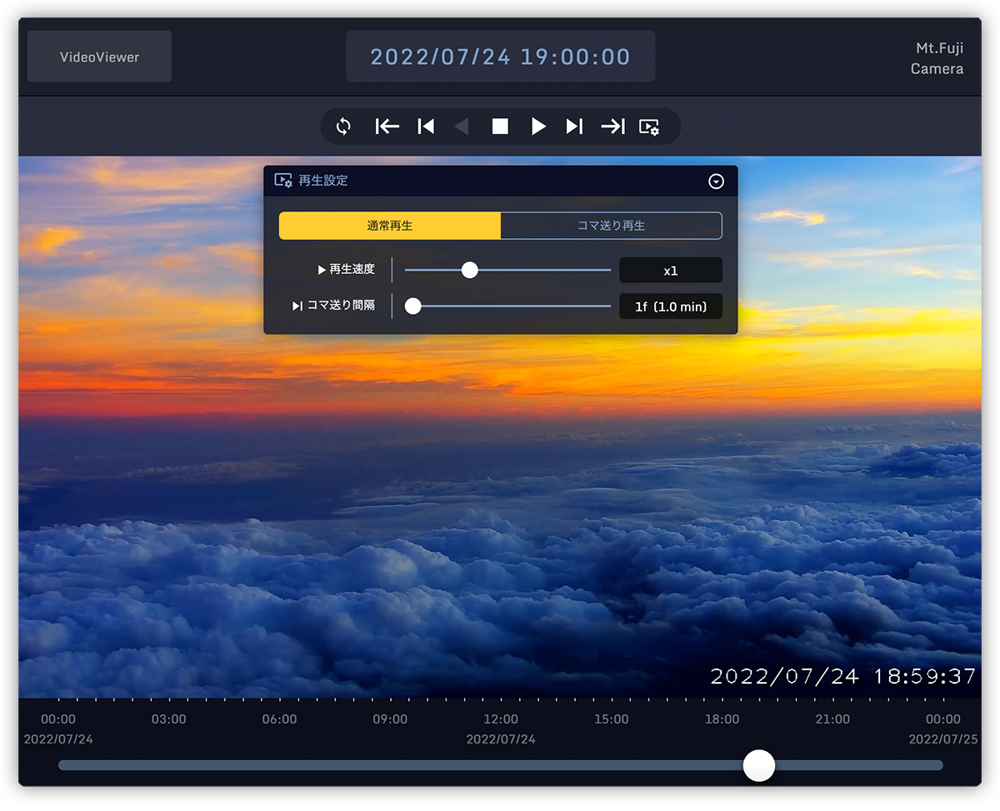

# VideoViewer
### 概要
Timelineを組み込んだ、ビデオファイル（MP4など）を再生するアプリです。

 

------------

### ライセンス

BSD2

------------

### 主な機能

- Timelineを使用し、ファイルをスクラブできます。
- 「通常再生」、「コマ送り再生」に対応しています。
- 「再生速度」、「コマ送り速度」、「コマ送り間隔」を変更できます。
- ViewURLにて再生ファイルやSTARTTIME、ENDTIMEなどを設定できます。
- VIewURLを使用せず、ファイル情報をJSONファイルから取得することもできます。

------------

### ViewURL例（urlパラメタ）

- st : startTime（開始日時）
- et : endTime（終了日時）
- ct : currentTime（初期表示日時）
- ft : frameTime (フレームタイム）
- src : source (ソースurl)
- lat : lat（緯度）
- lng : lng (経度）
- json : json (jsonの読み込み 真偽値）
- ui : ui (uiの表示/非表示 真偽値）
- bg : bg (背景色 CSS色指定）
- m1 : meta1（メタ情報1）
- m2 : meta2（メタ情報2）

```
https://hoge.jp/?src=sample.mp4&json=true&ft=60000&m1=SampleMovie&ct=2022-07-24T03:00:00Z&bg=rgb(0,0,0)&m1=Mt.Fuji&m2=Camera
```

------------

### Jsonファイル例
```Json
[
  {
    "stars.camera" : "Mt.Fuji",
    "stars.camera.model" : "Camera",
    "stars.starttime.UTC" : "2022-07-23T15:00:00Z",
    "stars.endtime.UTC" : "2022-07-24T15:00:00Z",
    "stars.latituide" : 36.5499473,
    "stars.longitude" : 138.1506513,
    "stars.altitude" : null,
    "stars.elevation" : null,
    "stars.azimath" : null,
    "stars.pan" : null,
    "stars.tilt" : null,
    "stars.zoom" : null,
    "stars.resolution" : "1920x1080",
    "stars.samplingtime.msec" : 60000,
    "stars.frames" : 1440,
    "stars.fps" : 30,
    "stars.missing" : true,
    "stars.pixelmapping": null
  }
]
```
